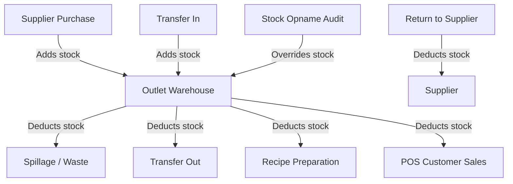

# Teras Lmbur OS — Inventory Ledger & Movement Blueprint

This document freezes the immutable inventory transaction ledgers and source/destination mappings.

---

## 1. Inventory Movement Flow

---

## 2. Movement Event Catalog

Every change in stock must create a ledger row logging:
- `TransactionType`
- `IngredientId`
- `Quantity` (decimal)
- `SourceEntity` (e.g. Supplier, Outlet Warehouse)
- `DestinationEntity` (e.g. Customer, Waste Bin, Partner Outlet)

| Movement Type | Stock Impact | Source | Destination |
|---|---|---|---|
| **PURCHASE** | Positive (+) | Supplier | Outlet Store |
| **PRODUCTION_USAGE** | Negative (-) | Outlet Store | Central Kitchen Prep |
| **WASTE** | Negative (-) | Outlet Store | Waste/Bin |
| **ADJUSTMENT** | Positive/Negative (±) | Manual Count | Outlet Store |
| **RETURN** | Negative (-) | Outlet Store | Supplier |
| **TRANSFER_IN** | Positive (+) | Partner Outlet | Local Outlet |
| **TRANSFER_OUT** | Negative (-) | Local Outlet | Partner Outlet |
| **STOCK_OPNAME** | Absolute Balance (=) | Audit Check | Outlet Store |
| **SALE_DEDUCTION** | Negative (-) | Outlet Store | Customer Order (Auto-BOM) |
