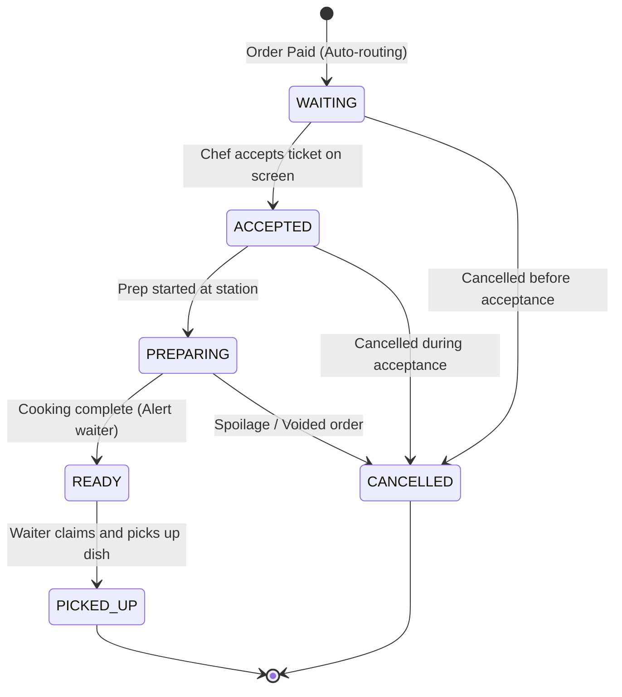

# Teras Lmbur OS — Kitchen Production Lifecycle Blueprint

This document freezes the state machine rules and transition constraints governing the Kitchen Display Screen (KDS) and chef routing.

---

## 1. Kitchen Ticket State Machine

Each KDS ticket processes through these chronological steps:

---

## 2. Operational Transition Rules

- **WAITING**: The ticket sits in the active queue matching target station templates (e.g. grill, fryer, bar).
- **ACCEPTED**: The chef acknowledges preparation load.
- **PREPARING**: The active timer starts ticking. Overtime limits (defined in configuration definitions) warn the manager of delays.
- **READY**: The screen alerts the waiter console. The timer stops, logging performance metrics.
- **PICKED_UP**: The ticket leaves KDS visibility.
- **CANCELLED**: If cancelled, cooking stops, and ingredients must log waste adjustments if cooking already started.
