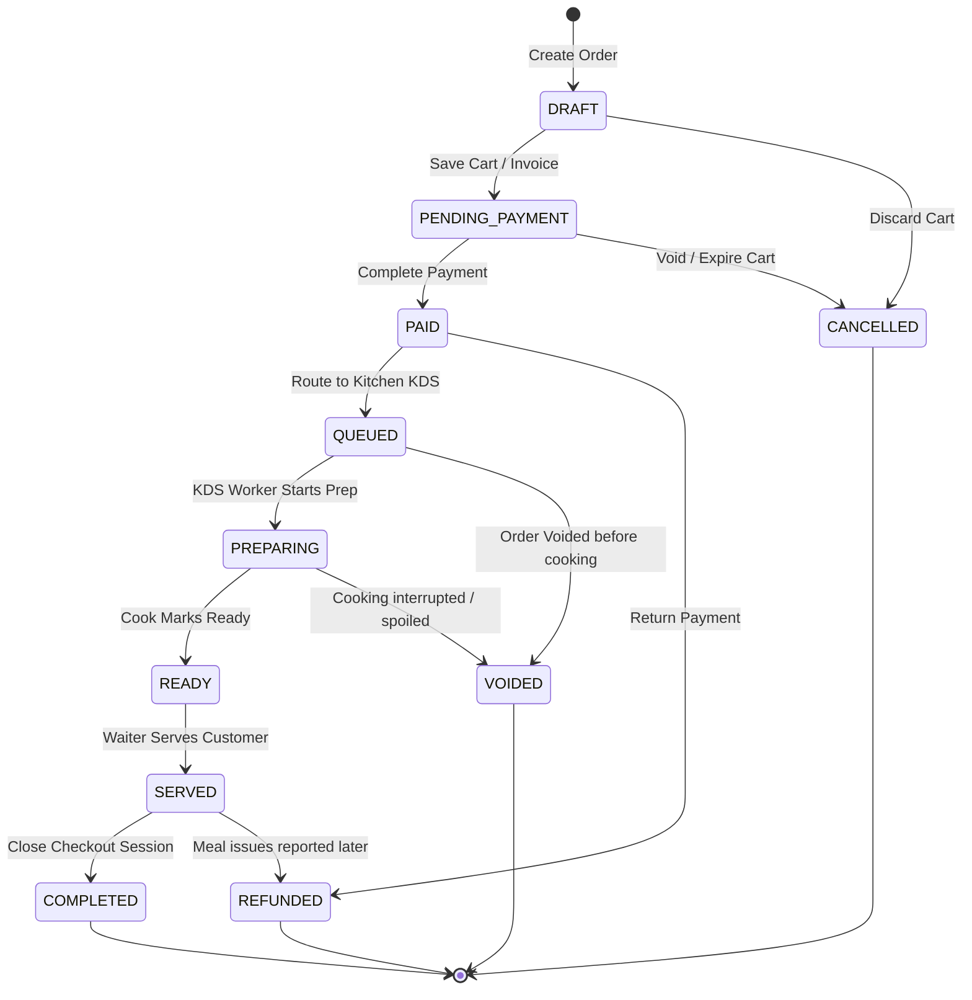

# Teras Lmbur OS — Order Lifecycle Blueprint

This document freezes the Order State Machine rules, valid transition paths, and compliance logic.

---

## 1. State Machine Definitions

---

## 2. Transition Compliance Matrix

Every state change must validate compliance against the following state transition rules. Illegal state transitions will throw `HttpStatus.BAD_REQUEST` with error code `ILLEGAL_STATUS_TRANSITION`.

| Origin State | Permitted Destination States | Triggers / Events |
|---|---|---|
| **DRAFT** | `PENDING_PAYMENT`, `CANCELLED` | Cashier locks cart; or cart discarded |
| **PENDING_PAYMENT** | `PAID`, `CANCELLED` | Cashier registers cash/card; or cart expires |
| **PAID** | `QUEUED`, `REFUNDED` | Print ticket triggered; or refund registered |
| **QUEUED** | `PREPARING`, `VOIDED` | Cook starts preparing; or cashier voids transaction |
| **PREPARING** | `READY`, `VOIDED` | Kitchen marks ready; or kitchen voids ticket |
| **READY** | `SERVED` | Waiter claims dish and serves table |
| **SERVED** | `COMPLETED` | Operational business day closes |
| **COMPLETED** | *(None)* | Immutable final archive state |
| **CANCELLED** | *(None)* | Final state |
| **VOIDED** | *(None)* | Final state |
| **REFUNDED** | *(None)* | Final state |
