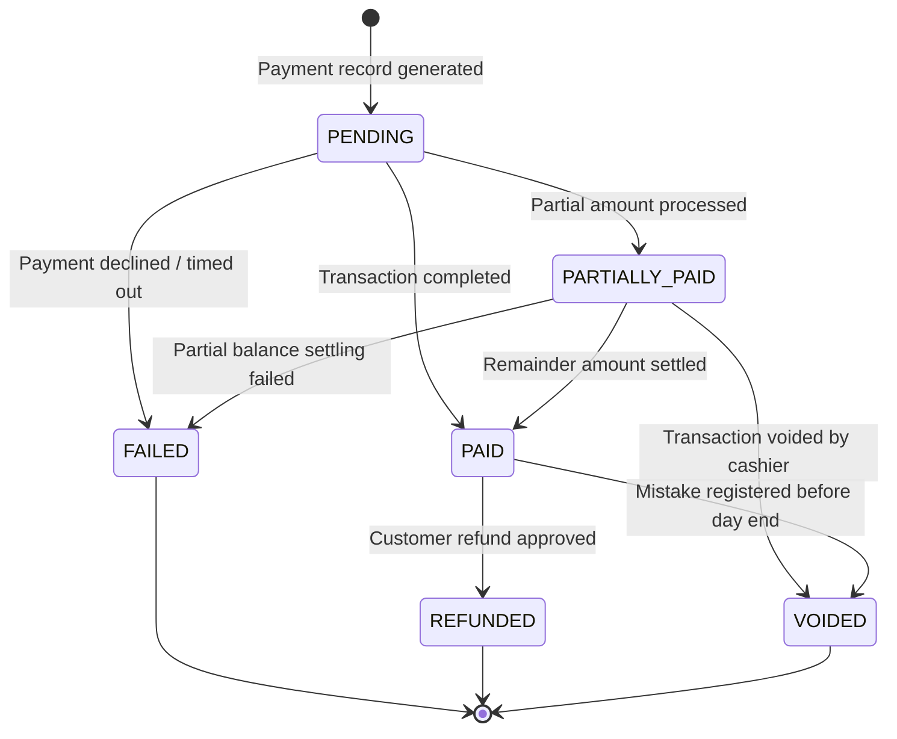

# Teras Lmbur OS — Payment Lifecycle Blueprint

This document freezes the multi-payment configurations, checkout payment states, and split-payment transactions rules.

---

## 1. Payment Lifecycle State Machine

---

## 2. Multi-Payment & Split-Payment Rules

Teras Lmbur OS supports splitting a single invoice across multiple payment methods:

1. **Split Allocation**:
   - The user selects amounts to allocate across payment methods.
   - Example: 50% Cash + 50% Bank Transfer.
2. **State Rules**:
   - The overall order stays in `PENDING_PAYMENT` until all split payment records sum to the total bill amount.
   - Each payment transaction has its own immutable `PaymentStatus` (PENDING, PAID, FAILED).
   - If split payments are partially completed, the order has status `PENDING_PAYMENT` and total payments are registered, but the order is not yet marked `PAID`.
3. **Database-Driven Providers**:
   - Supported payment methods are loaded from the database: `Cash`, `InstaPay`, `Bank Transfer`, `Visa`, `Mastercard`, and `Wallet`.
   - Adding a payment provider does not require database migration (configuration registry driven).
