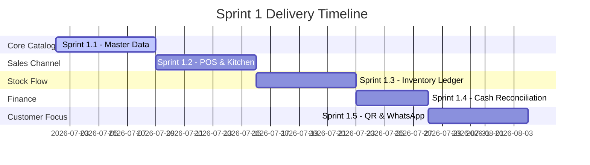

# Teras Lmbur OS — Sprint 1 Implementation Roadmap

This document freezes the step-by-step roadmap for business module implementations.

---

## 🗺️ Sprint 1 Business Phases

---

## 📋 Phase Details

### Sprint 1.1: Master Data
- **Entities**: Categories, Products, Variants, Modifiers, Recipe Bill of Materials (BOM), Units of Measurement (UOM).
- **Goal**: Establish catalog schemas and validations.

### Sprint 1.2: POS & Floor Operations
- **Entities**: Floor Order, Cart, Cashier Checkout, KDS Ticket Routing.
- **Goal**: Support order placement and waiter alerts.

### Sprint 1.3: Inventory Ledger
- **Entities**: Purchase Order, Waste Log, Adjustment Ledger, Supplier Master.
- **Goal**: Automated ingredient deducts matching recipes.

### Sprint 1.4: Finance & Shifts
- **Entities**: Cash Drawer shifts, Shift Closing, Expenses ledger.
- **Goal**: Reconcile cashier drawer counts.

### Sprint 1.5: Customer & Integrations
- **Entities**: Customer Profile, Loyalty Balance, QR Seating, WhatsApp orders.
- **Goal**: Self-ordering options.
