# Teras Lmbur OS — Cashier Shift Lifecycle Blueprint

This document freezes the operations, validation states, and cash register audit workflows.

---

## 1. Cashier Shift State Machine

```mermaid
stateDiagram-v2
    [*] --> OPENING : Cashier logs opening cash
    OPENING --> ACTIVE : Manager approves opening drawer
    
    ACTIVE --> ACTIVE : Register Cash In / Cash Out (Expense)
    
    ACTIVE --> CLOSING : Cashier logs final actual drawer cash count
    
    CLOSING --> CLOSED : Audit matches drawer variance; OR owner override APPROVED
    CLOSING --> REOPENED : Discrepancy audit failed; cashier recounts drawer
    
    REOPENED --> ACTIVE : Cashier corrects ledger
    CLOSED --> [*]
```

---

## 2. Shift Reconciliation Calculations

Every shift closing triggers calculations of expected cash vs actual cash:

$$\text{Expected Cash} = \text{Opening Cash} + \text{Cash Sales} + \text{Cash In} - \text{Cash Out (Expenses)}$$

$$\text{Variance (Difference)} = \text{Actual Cash Drawer Count} - \text{Expected Cash}$$

### Discrepancy Approval Workflow
- If $\text{Variance} = 0$, the shift moves to `CLOSED` immediately.
- If $\text{Variance} \neq 0$:
  - A notification event `CASH_CLOSING_DISCREPANCY` publishes.
  - The shift is held in `CLOSING` state.
  - An owner or store manager must submit an **Owner Override** approval (assigning a variance reason string) to force transition to `CLOSED`.
