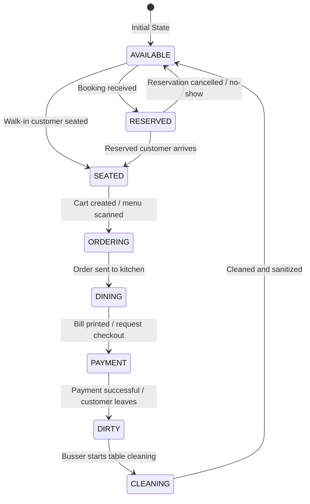
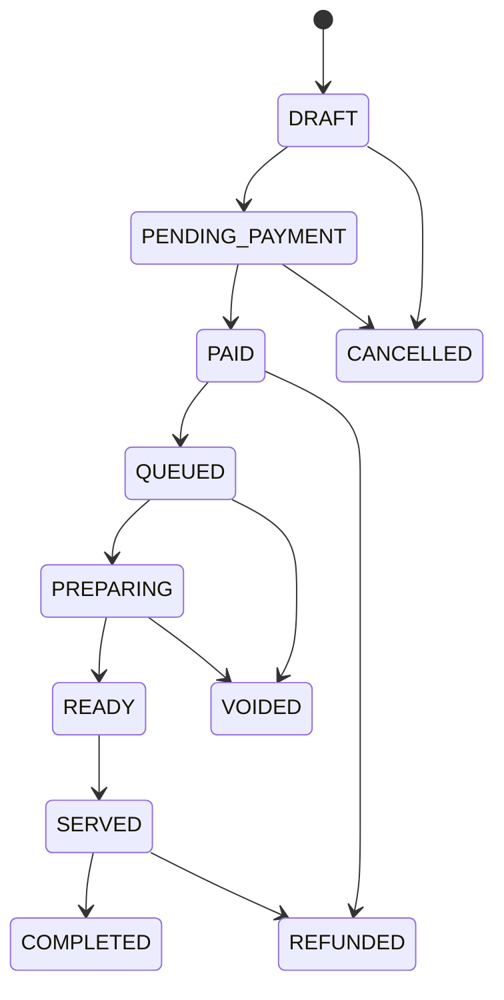
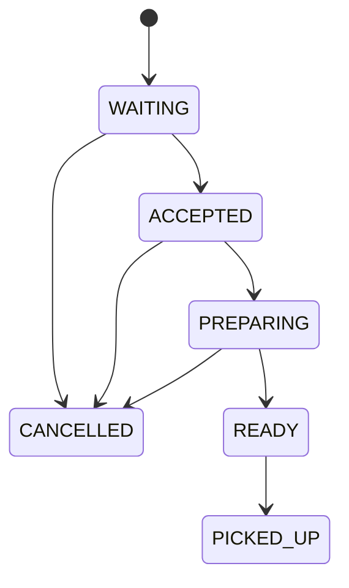
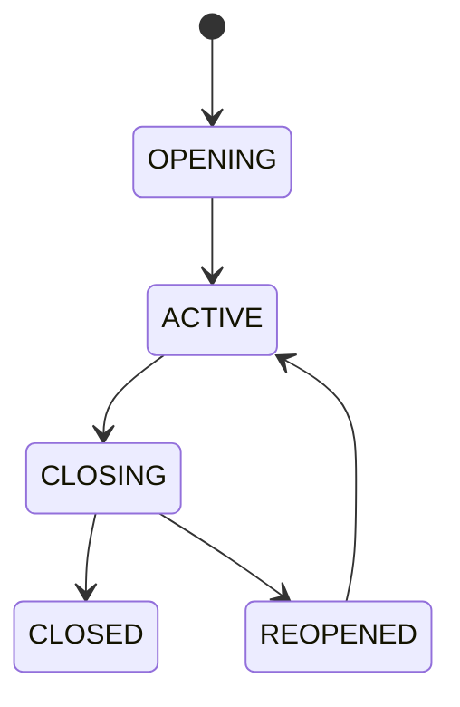

# Teras Lmbur OS — Enterprise State Machines

This document compiles the Mermaid state machine diagrams governing the system workflows.

---

## 1. Table Lifecycle State Machine

Defines the seating status and ordering progression for dining tables.

---

## 2. Order Lifecycle State Machine

---

## 3. Kitchen Production Lifecycle State Machine

---

## 4. Cashier Shift State Machine

