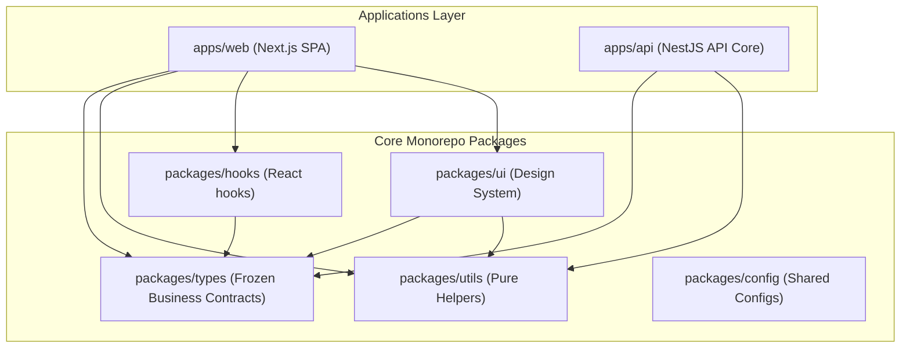

# Teras Lmbur OS — Foundation Freeze Baseline

This document specifies the frozen architectural baseline, directory layout rules, development standards, coding conventions, and platform integrations for **Teras Lmbur OS**. All features implemented starting in Sprint 1 and beyond must adhere strictly to these patterns. No architectural refactoring may occur after this milestone without critical justification.

---

## 1. Platform Architecture

Teras Lmbur OS is built as a Clean Architecture and Domain-Driven Design (DDD) monorepo. It cleanly splits concerns into frontend applications, backend services, core domain layers, and UI/util libraries.



---

## 2. Directory Layout & Folder Conventions

### Monorepo Structure
- `apps/` — Executable services.
  - `web/` — React frontend built on Next.js App Router.
  - `api/` — NestJS server exposing the REST APIs and background queues.
- `packages/` — Shared libraries resolved as workspace references.
  - `config/` — Transpiled shared setups (TypeScript, ESLint, Tailwind, etc.).
  - `hooks/` — React-specific hooks (sidebar controls, local storage states, etc.).
  - `types/` — Shared interfaces, TypeScript types, and domain-contract enums.
  - `ui/` — React UI components (primitives, cards, inputs) built on TailwindCSS.
  - `utils/` — Pure utility modules (currency conversion, date calculation, math, etc.).

### Next.js App Layout (`apps/web`)
- `src/app/[locale]` — All routes must live inside the `[locale]` dynamic routing group.
  - `(auth)` — Contains auth layouts and the `/login` page.
  - `(dashboard)` — Authenticated pages (POS layout wrapper, sidebar, header).
- `src/components` — Shared UI elements (layout structures, navigation elements).
- `src/i18n` — Localization parameters, routing configurations, and request wrappers.
- `src/providers` — Global client-side provider wrappers (React Query, theme controls, etc.).

### NestJS App Layout (`apps/api`)
- `src/modules` — Feature domains split cleanly into submodules:
  - `system/` — Cross-cutting concerns (Auth, Audit, Context, Redis, Settings, Translation, Queue).
  - `pos/` — Outlets, Tables, Orders, Invoices.
  - `kitchen/` — Production tickets, station statuses.
  - `inventory/` — Products, suppliers, movements, stock.
  - `finance/` — Invoices, expenses, daily/monthly reports.
- `src/common` — Standardized filters, interceptors, guards, and decorators.

---

## 3. Dependency Baselines (Version Freeze)

- **Node.js**: `>=20.0.0`
- **pnpm**: `>=9.0.0` (Workspace manager)
- **Next.js**: `16.2.9`
- **NestJS**: `^11.0.1`
- **Prisma Client**: `^6.2.1`
- **Redis (ioredis)**: `^5.4.2`
- **BullMQ**: `^5.34.8`
- **React**: `19.2.4`
- **next-intl**: `^3.26.3`
- **TailwindCSS**: `^4`

---

## 4. Coding & Naming Conventions

### File & Component Naming
- **React Components**: PascalCase for directories and files (e.g. `StatCard.tsx`, `AppButton.tsx`).
- **TypeScript files**: kebab-case for pure utility modules and service classes (e.g. `money.ts`, `translation.service.ts`).
- **Enums & Constants**: Upper snake_case (e.g. `OrderStatus.PENDING_PAYMENT`).
- **Prisma Models**: PascalCase (e.g. `ProductTranslation`).

### TypeScript Requirements
- All codebases must build under `strict: true` flags.
- Avoid the use of `any` types wherever possible. If an object is parsed dynamically, wrap in standard generic constraints or define `Record<string, unknown>`.
- Keep arrays of indexed references safe from `undefined` compiler warnings by applying explicit fallback evaluations:
  ```typescript
  const share = allocations[i] ?? BigInt(0);
  ```

---

## 5. API & Payload Standards

- **Endpoint Prefix**: All REST endpoints must begin with `/api/v1/` except health verification URLs (e.g. `/health` under `/`).
- **API Versioning**: Enforced at application router level via URI versioning:
  ```typescript
  app.enableVersioning({ type: VersioningType.URI, defaultVersion: '1' });
  ```
- **Response Format**: Enforced by NestJS global interceptors (`TransformInterceptor`):
  ```json
  {
    "success": true,
    "data": { ... },
    "meta": { "timestamp": "..." }
  }
  ```
- **Error Exceptions**: Must extend standard `HttpException` and render as:
  ```json
  {
    "success": false,
    "error": {
      "code": "BAD_REQUEST",
      "message": "Detailed warning description"
    }
  }
  ```

---

## 6. Events & Background Processing (Queue Standards)

- **Event Bus**: Event communication within NestJS is handled locally by `@nestjs/event-emitter` for in-process lifecycle events.
- **Queues & Jobs**: Asynchronous background operations (e.g., WhatsApp dispatch, report generation, printing) are processed via BullMQ queues powered by Redis.
- **Queue Base Class**: Every worker must extend the centralized `QueueBase` class to maintain consistent connection lifecycles, error logging, and retry logic.

---

## 7. Money & Precision Conventions

Teras Lmbur OS uses integer-based precision mapping to avoid decimal rounding errors during complex calculations.
- **Representation**: Stored as a big integer (`BigInt`) representing the smallest unit of currency (cents).
- **Default Currency**: `EGP` (Egyptian Pound).
- **Default Precision**: `2` decimal places.
- **Calculation Class**: Enforced via the `Money` utility class (`packages/utils/src/money.ts`). Avoid floating point math (`+`, `-`, `*`, `/`) for money.

---

## 8. Role-Based Access Control (RBAC)

System access is structured around system roles defined in the `SystemRole` contract (`packages/types/src/enums.ts`):
- `SystemRole.OWNER` — Full tenant privileges.
- `SystemRole.MANAGER` — Store management, pricing, and stock controls.
- `SystemRole.CASHIER` — Shift handling, payment processing, invoice generation.
- `SystemRole.KITCHEN` — Food preparation, station ticket management.
- `SystemRole.WAITER` — Dine-in table ordering.
- `SystemRole.CUSTOMER` — Self-ordering kiosk / QR code table menus.

Guards are applied at route controller levels using the `@Roles` decorator:
```typescript
@UseGuards(JwtAuthGuard, RolesGuard)
@Roles(SystemRole.OWNER, SystemRole.MANAGER)
```

---

## 9. Theme System & Styling Tokens

Styling utilizes vanilla CSS custom properties (variables) coupled with Tailwind classes. Dynamic CSS theme tokens are loaded directly from the database registry (global settings) on page load and injected as variables:
- Primary Brand Color: `--brand-primary` / `--brand-500`
- Success Indicator: `--success-500`
- Border Radii: `--border-radius`

### Theme Switching
Supported themes include `light` and `dark`. Use `<ThemeProvider>` wrappers to change standard classes and automatically map HSL ranges across tokens.

---

## 10. Localization & Translation Architecture

The platform supports a dual-layer localization system:

### 1. Static UI Localization (Frontend)
- Handled by `next-intl`.
- Translation JSONs live in `apps/web/messages/[locale]/[namespace].json`.
- Navigation and page routing must wrap standard browser APIs using `@/i18n/routing` hooks (`Link`, `usePathname`, `useRouter`, `redirect`) to ensure locale prefixes (`/en`, `/id`, `/ar`) are strictly preserved.

### 2. Dynamic Entity Localization (Backend)
- Handled by the NestJS `TranslationService`.
- Translations are normalized in PostgreSQL tables withcomposite indices (e.g. `categoryId` + `locale` on `CategoryTranslation`).
- Caching is managed dynamically in Redis under the key prefix `translation:${entityType}:${entityId}`. Cache entries are automatically invalidated upon any CRUD mutation (creation, modification, or removal).
- **Fallback Resolution Chain**:
  1. Requested Locale
  2. English (`'en'`)
  3. Indonesian (`'id'`)
  4. First available translation record in the database.
