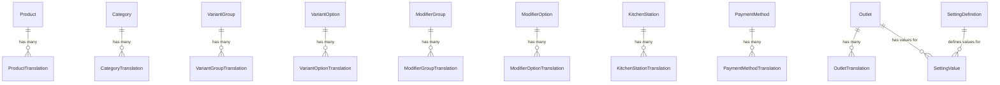

# Teras Lmbur OS — Localization & Enterprise Configuration System v1.1

This guide explains the translation schemas, configuration registry definitions, dynamic CSS variables mapping, and Redis caching layers.

---

## 1. Database Schema Changes (ERD Review)

We replaced column-based translations with a fully normalized **Translation Table** design. This allows infinite locales to be supported with zero future database schema changes.

### ERD Mappings


Each Translation table uses a unique composite index of `(entityId, locale)`.
For example, `ProductTranslation`:
- `productId` (foreign key to Product)
- `locale` (locale code e.g. `'en'`, `'id'`, `'ar'`)
- `name` (localized product name)
- `description` (optional localized description)

---

## 2. Enterprise Configuration Registry

Settings are managed via metadata definitions inside the database rather than rigid key-value pairs or environment variables.

### SettingDefinition Registry Fields
- `key` (unique configuration string identifier)
- `group` (General, Branding, Business, POS, Kitchen, Inventory, Finance, Receipt, Notification, Security, Developer, Analytics)
- `label` (Human-readable form description)
- `type` (string, number, boolean, json, color, currency, timezone, url, email, phone, image, password)
- `defaultValue` (default configuration text)
- `validationRule` (regex validation formatting rules)
- `isPublic` (accessible to client browsers directly)
- `isEncrypted` (whether secrets are decrypted dynamically on server runtimes)

---

## 3. Dynamic Theme Token System

All system design properties are loaded dynamically from settings and output as CSS variables into the layout.

### Configured UI Theme Tokens
- `brand.primary` (maps to `--brand-primary` color custom property)
- `brand.secondary` (maps to `--brand-secondary`)
- `brand.accent` (maps to `--brand-accent`)
- `brand.success` (maps to `--brand-success`)
- `brand.warning` (maps to `--brand-warning`)
- `brand.error` (maps to `--brand-error`)
- `surface.background` (maps to `--surface-background`)
- `surface.card` (maps to `--surface-card`)
- `sidebar.width` (maps to `--sidebar-width` width sizing)
- `sidebar.background` (maps to `--sidebar-background`)
- `border.radius` (maps to `--border-radius`)
- `font.heading` / `font.body` (maps to `--font-sans`)
- `shadow.card` (maps to `--shadow-card` shadows depth)
- `animation.speed` (maps to `--animation-speed` transition durations)

---

## 4. Global Settings Cache Flow

To avoid expensive database queries on critical execution paths, settings are cached in Redis with active invalidation.

```
[Application Request]
         │
         ▼
[Redis Cache Lookup] ──► (Hit) ──► [Return Value <1ms]
         │
      (Miss)
         ▼
[PostgreSQL DB Fetch]
         │
         ▼
[Write to Redis Cache]
         │
         ▼
[Return Value to App]
```

### Cache Invalidation Rationale
Whenever a setting is updated via `SettingsService.set()`, the cache key `setting:${outletId}:${key}` is deleted. Subsequent requests trigger a cache miss, reloading the updated parameters dynamically.

---

## 5. Localization & Translation Strategy

### Fallback Order
If the requested locale translation is missing for an entity, the system checks:
1. **Requested Locale** (e.g. `'id'`)
2. **English** (Fallback default `'en'`)
3. **Indonesian** (Fallback base `'id'`)
4. **First Available translation record** if all fallbacks miss.

### Date & Currency Formatter Standard
All prices and calendars are formatted client-side using locale-aware native browser standard classes `Intl.NumberFormat` and `Intl.DateTimeFormat`.
- Price standard format: `CurrencyFormatter.format(amount, 'EGP', 'en-US')` -> `EGP 1,200.00`
- Date standard format: `DateFormatter.format(date, 'id-ID')` -> `1 Jul 2026`
