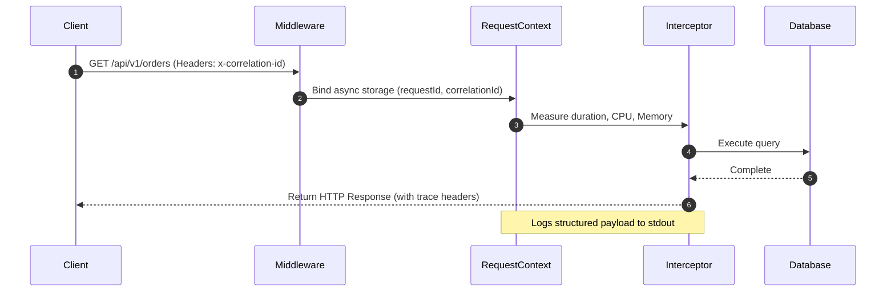
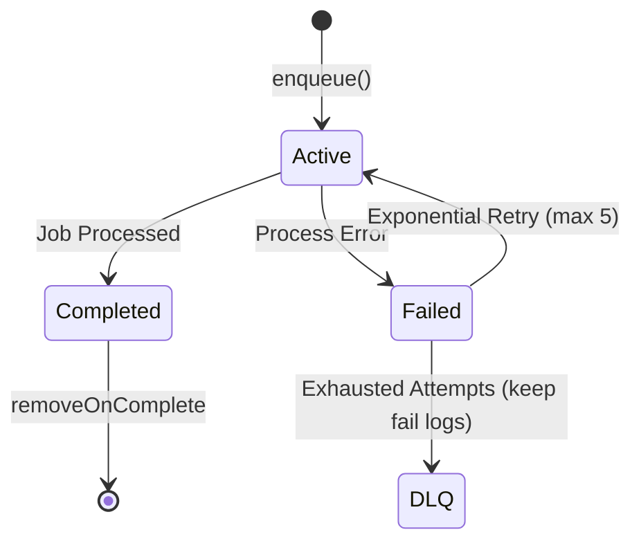

# Teras Lmbur OS — Production Platform Readiness & Enterprise Infrastructure

This document describes the platform architecture, event systems, queue runtimes, storage abstractions, money structures, and context propagators introduced in Sprint 0.95.

---

## 1. Platform Architecture

Teras Lmbur OS relies on a fully decoupled, enterprise-grade architecture. Synchronous operations (API requests) leverage in-memory scopes and sub-millisecond lookups, while asynchronous tasks (printing, emails, analytics calculations) run inside resilient BullMQ queues.

```
                  [Client Request]
                         │
                         ▼
             [RequestContext Middleware]
                         │
                         ▼
             [HTTP Logging Interceptor]
                         │
          ┌──────────────┴──────────────┐
          ▼                             ▼
   [Event Bus (EventEmitter)]   [Background Queues]
   (Sub-millisecond Pub/Sub)    (BullMQ + Redis)
          │                             │
          ├─► order.created             ├─► PrintQueue
          ├─► order.updated             ├─► NotificationQueue
          └─► payment.completed         └─► ReportQueue
```

---

## 2. Observability & Health Check Specification

### Trace Propagation Flow
Every request is intercepted by `RequestContextMiddleware` which maps three unique identifiers:
1. `requestId` (Request identifier)
2. `correlationId` (Tracks operations spanning multiple workflows)
3. `traceId` (Request pipeline trace scope)

These are automatically integrated into all Pino logs via `LoggerModule.forRoot({ pinoHttp: { customProps() } })`.



### Health Check API
We expose four health endpoints under `/api/v1/health`:

| Endpoint | Method | Purpose | Verified Downstream Resources |
|---|---|---|---|
| `/api/v1/health` | GET | Comprehensive platform diagnostic | PostgreSQL (`$queryRaw`), Redis (`ping`), Queue links, Storage status |
| `/api/v1/health/liveness` | GET | Container runtime verification | None (immediate `UP`) |
| `/api/v1/health/readiness` | GET | Verifies if node can accept transactions | PostgreSQL, Redis |
| `/api/v1/health/version` | GET | Uptime, env, version, commit SHA | None |

---

## 3. Domain Event Bus

Events are derived from `BaseDomainEvent` to decouple business modules.

### Event Schema
```typescript
class BaseDomainEvent<T = any> {
  readonly eventId: string;        // Unique event UUID
  readonly eventName: string;      // Dot-notated string (e.g. order.created)
  readonly occurredAt: Date;       // Timestamp
  readonly aggregateId: string;    // Target aggregate identifier
  readonly aggregateType: string;  // Target aggregate class (e.g. Order)
  readonly version: number;        // Event version
  readonly payload: T;             // Enriched payload data
  readonly correlationId?: string; // Request correlation link
  readonly requestId?: string;     // Request identifier
  readonly metadata?: Record<string, any>;
}
```

### Naming Conventions
- Event names must use dot-notation in lowercase format: `<aggregate>.<action>`.
- Examples: `order.created`, `order.updated`, `order.cancelled`, `payment.completed`, `inventory.adjusted`, `shift.closed`.

---

## 4. Background Queue Lifecycle (BullMQ)

Queues standardizations are enforced using `QueueBase`. 



### Standardized Protections
1. **Exponential Backoff**: Retries are scheduled with `attempts: 5` and 2s base delays.
2. **Idempotency Locks**: Redis keys (`lock:job:${jobId}`) prevent double execution of identical jobs within a 10s window.
3. **Dead Letter Queue (DLQ)**: `removeOnFail: false` preserves details of failed workers in Redis for supervisor review.

---

## 5. Storage & Notification Architecture

Decoupling is achieved through interfaces:

### Storage Architecture
`StorageProvider` supports dynamic driver switching via settings (`storage_provider_driver` in database definitions):
- **Cloudflare R2**: Default provider (`R2StorageProvider`).
- **Amazon S3**: Future driver.
- **MinIO**: Future local S3 driver.

Exposes:
- `upload(key, buffer, mimeType)`
- `download(key)`
- `delete(key)`
- `copy(src, dest)`
- `move(src, dest)`
- `temporaryUrl(key, expires)`
- `exists(key)`
- `metadata(key)`

### Notification Flow
The `NotificationGateway` isolates business logic from channels (WhatsApp, email, SMS, push, Telegram):
```
[Business Module] ➔ [NotificationGateway.send()] ➔ [MockNotificationProvider]
```

---

## 6. Money Value Object Guide

Floating-point precision errors are eliminated by wrapping monetary calculations in a strict, immutable `Money` Value Object (VO) utilizing `bigint` under the hood.

### Arithmetic & Allocation
```typescript
import { Money } from '@teras-lmbur/utils';

// Instantiation (150.00 EGP)
const price = new Money('150.00', 'EGP');

// Math operations (Returns NEW instance, preserving immutability)
const taxedPrice = price.tax(14); // 14% VAT
const finalPrice = taxedPrice.subtract(new Money('5.00', 'EGP'));

// penny-fraction allocation without losing remainder units
const [shareA, shareB] = finalPrice.allocate([1, 1]); // Split evenly
```

---

## 7. Request Context Guide

Using Node's `AsyncLocalStorage`, request metadata is accessible anywhere in the monorepo without parameter passing:

```typescript
import { RequestContextService } from './request-context.service';

@Injectable()
export class ProductService {
  constructor(private readonly context: RequestContextService) {}

  async createProduct(data: any) {
    const outletId = this.context.outletId; // Resolved dynamically!
    const businessDate = this.context.businessDate;
    
    // ...
  }
}
```

---

## 8. API Versioning Guide

API routes are partitioned using NestJS URI Versioning:
- **Default version**: `v1` (endpoints resolved as `/api/v1/...`).
- **Swagger routing**: Exposes documentation for active endpoints under `/docs`.
- Controllers override defaults by supplying `version` properties:
```typescript
@Controller({ path: 'orders', version: '2' })
export class OrdersV2Controller {}
```
