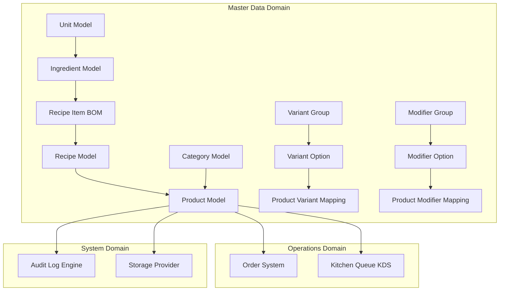
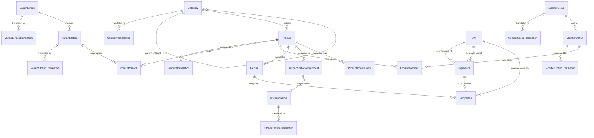

# Teras Lmbur OS — Sprint 1 Design Freeze Reference Blueprint

This document acts as the immutable design freeze reference for **Sprint 1: Master Data Platform**. No business logic implementation should deviate from the contracts, flows, and architectures defined here.

---

## 1. Module & Domain Boundaries

Sprint 1 encompasses the foundational registry of the restaurant’s core assets. It is isolated from active transactions but acts as the static lookup backend.



---

## 2. Database Design Freeze (ERD Diagram)

The schema has been designed to prevent future architectural refactoring during inventory, purchase, or finance sprints.



### Entity Specifications

#### Category Table
- `parentId`: Nullable self-referential foreign key.
- `deletedAt`: DateTime column supporting Soft Delete.
- **Hierarchy constraint**: Business validation must enforce `category.parentId` cannot refer to a category that itself has a `parentId` (restricting the depth strictly to 2 levels: Root Category $\rightarrow$ Sub-category).

#### Product Table
- `sellingPrice`: Decimal type `(12,2)` (no float data storage).
- `currentHpp`: Decimal type `(12,2)`. Replaces generic cost column. Recomputed automatically by HPP Calculator.
- `barcode`: Nullable unique string (e.g. UPC/EAN format) to support future physical hardware scanners.
- `availabilityStatus`: Enum (`AVAILABLE`, `UNAVAILABLE`, `OUT_OF_STOCK`, `DISCONTINUED`).
- `preparationTime`: Default prep time in minutes (integer, default `15`).

#### ProductPriceHistory Table
- Tracks selling price, current HPP, actor, change reason, and activation date-time.
- `sellingPrice`: Decimal `(12,2)` capturing historical selling price.
- `currentHpp`: Decimal `(12,2)` capturing historical cost base.
- `changedById`: Reference to User who triggered change.
- `reason`: Nullable string explanation for cost change.
- `effectiveAt`: Timestamp for history analysis.

#### Ingredient Table
- `minimumStock`, `reorderLevel`, `idealStock`: High-precision decimals `(12,4)` for future automated inventory reorder pipelines.
- `inventoryUnitId`: Required foreign key (Unit). Refers to how the kitchen counts raw consumption (e.g. grams).
- `purchaseUnitId`: Nullable foreign key (Unit). Refers to how inventory is purchased (e.g. a bag/box of 10kg).
- `conversionRatio`: Decimal `(12,4)` denoting how many inventory units are in a single purchase unit (e.g., if a box contains 10kg, ratio = `10.0000`).

#### Recipe BOM Table
- `version`: Sequential integer increments (BOM version history tracker).
- `effectiveDate`: Start date/time of this BOM version's operational activation.
- `isActive`: Boolean flag. Only one recipe can be active per product at any given moment.
- `wastePercentage` (inside `RecipeItem`): Decimal `(5,2)` representing preparation shrinkage (e.g. peeled vegetables waste 15%, value stored as `15.00`).

---

## 3. Product Versioning & Future Extensibility Strategy

To prevent breaking existing checkout, orders, or sales reporting APIs when menu parameters (prices, modifiers, names) change, the system establishes a dual-tier versioning pattern:

1. **Active Menu Snapshot (Checkout Path):** 
   When an order is created, the system copies prices, names, and modifier selections into the `OrderItem` table as immutable values. 
2. **Historical Catalog States (Future Versioning API):**
   For future compliance audits, when a product undergoes a structural overhaul, the system will insert a new row in a `ProductHistory` log containing serialized JSON versions of the product state at that timestamp, while the parent `Product.id` remains stable to prevent foreign key updates in active databases.

---

## 4. HPP (COGS) Calculator Flow

The HPP Calculator acts as a background domain event handler, recalculating product costs automatically to protect database performance.

$$HPP = \sum \left( IngredientCost \times Quantity \times (1 + \frac{Waste\%}{100}) \right)$$

### Cost Recalculation Flow

```
[Trigger Source]
  - Ingredient.costPerUnit updated
  - Recipe details modified
  - Recipe activated or archived
        │
        ▼
[Publish Event (EventBus)]
  - IngredientCostUpdated
  - RecipeUpdated / RecipeActivated
        │
        ▼
[HppService Listener]
  - Fetches target Product IDs using active recipes
  - Queries active RecipeItems & Ingredient.costPerUnit
  - Computes HPP via decimal precision (Money Value Object)
        │
        ▼
[Database Transaction]
  - Updates Product.currentHpp column
  - Publishes HppRecalculatedEvent
```

---

## 5. Kitchen & Printer Architecture

The system transitions from direct association to a junction-based **Kitchen Station Assignment** model.

```
[Product]
    │
    ▼ (1-to-many junction)
[Kitchen Station Assignment] (e.g., grill station, isPrimary = true)
    │
    ▼
[Kitchen Station]
    │
    ▼ (1-to-many printer routing)
[Printer] (Kitchen slip printer / Ticket terminal)
```

- A product can map to multiple stations (e.g. grill station and drinks bar), but exactly one is marked `isPrimary: true`.
- KDS ticket queues scan the assignments to determine routing queues.

---

## 6. Storage Provider Abstraction

All uploads must pass through a strict storage driver boundary to decouple the application from physical cloud hosting.

```typescript
export interface StorageProvider {
  uploadFile(file: Express.Multer.File, path: string): Promise<string>;
  deleteFile(path: string): Promise<void>;
}
```

- **Sprint 1 (Local):** `LocalStorageProvider` reads/writes files under the `/apps/web/public/uploads` local folder and returns the relative path URL.
- **Sprint 2 (Production):** `CloudflareR2StorageProvider` implements the interface to upload files directly using S3 SDK credentials with zero changes to presentation layers.

---

## 7. Soft Delete Policy

No Master data row can be deleted using SQL `DELETE`. All entities use soft deletion.

### Soft Delete Fields
Every primary Master model has:
- `deletedAt: DateTime?` (default NULL)

### Repository Contract
Repository layer methods must strictly append the exclusion parameter:
```typescript
async findMany() {
  return this.prisma.product.findMany({
    where: { deletedAt: null }
  });
}
```
If an entity is deleted, it updates `deletedAt = now()`. Restoring an entity simply resets `deletedAt = null`.

---

## 8. Audit Logging Specifications

Audit logs record all mutative history for debugging and security analysis. 

### Audit Log Schema
```prisma
model AuditLog {
  id         String   @id @default(cuid())
  action     String   // e.g. 'product.create', 'recipe.activate'
  resource   String   // e.g. 'Product', 'Recipe'
  resourceId String
  oldValue   Json?    // State before mutation
  newValue   Json?    // State after mutation
  ipAddress  String?
  userAgent  String?
  device     String?
  userId     String   // Actor
  createdAt  DateTime @default(now())
}
```
The `AuditService` automatically resolves client details via the `RequestContextService` thread storage.

---

## 9. API Contract Freeze

All Master Data endpoints return a standardized success envelope.

### Standard Response Envelope
```typescript
interface ApiResponse<T> {
  success: boolean;
  data: T;
  message?: string;
  timestamp: string;
}
```

### Endpoints Specifications

| Route | Method | Permissions | Request DTO | Response DTO / Payload |
|---|---|---|---|---|
| `/api/v1/categories` | GET | `categories.read` | Query: pagination, sorting, search | `PaginatedResponse<Category[]>` |
| `/api/v1/categories` | POST | `categories.create` | `CreateCategoryDto` | `ApiResponse<Category>` |
| `/api/v1/categories/:id` | PUT | `categories.update` | `UpdateCategoryDto` | `ApiResponse<Category>` |
| `/api/v1/categories/:id` | DELETE | `categories.delete` | Reason query string | `ApiResponse<{ id: string }>` |
| `/api/v1/products` | GET | `products.read` | Query: pag, sorting, filter, search | `PaginatedResponse<Product[]>` |
| `/api/v1/products` | POST | `products.create` | `CreateProductDto` | `ApiResponse<Product>` |
| `/api/v1/products/:id` | PUT | `products.update` | `UpdateProductDto` | `ApiResponse<Product>` |
| `/api/v1/products/:id` | DELETE | `products.delete` | Reason query string | `ApiResponse<{ id: string }>` |
| `/api/v1/products/:id/price-history` | GET | `products.read` | Query: page, pageSize | `PaginatedResponse<ProductPriceHistory[]>` |
| `/api/v1/recipes` | POST | `recipes.create` | `CreateRecipeDto` | `ApiResponse<Recipe>` |
| `/api/v1/recipes/:id/activate` | POST | `recipes.update` | None | `ApiResponse<Recipe>` |
| `/api/v1/ingredients` | GET | `inventory.read` | Query: sorting, search | `PaginatedResponse<Ingredient[]>` |
| `/api/v1/units` | GET | `inventory.read` | Query | `PaginatedResponse<Unit[]>` |

---

## 10. UI Design Freeze & Blueprint

The interface will feature a highly polished glassmorphism dark-mode look, utilizing a unified grid structure, custom drawer sliders, and optimistic TanStack query state updates.

### Modules Sitemap & Features

```
Dashboard
└── Management (Sidebar Section)
    ├── Products Page
    │   ├── Table: SKU, Name, Category, HPP, Selling Price, Stations, Status
    │   ├── Filters: Category, Status, Featured, Alert Stock
    │   └── Drawer: Image upload, translations (EN/ID), SKU auto-gen, base price, BOM builder
    ├── Categories Page
    │   ├── Table: Icon, Name (EN/ID), Slug, Sorting, Active Status
    │   └── Drawer: Hierarchy selector (root or child), icon picker, translation fields
    ├── Variants Page
    │   ├── Table: Group Name (Size, Temp), Options count, usage status
    │   └── Drawer: Group title translation, dynamic list of options (add/remove tags)
    ├── Modifiers Page
    │   ├── Table: Modifier Group, min/max selection bounds, options
    │   └── Drawer: Group title translation, required toggles, min/max rules, option prices
    ├── Ingredients Page
    │   ├── Table: SKU, Name, Cost per unit, purchase vs inventory unit, stock levels
    │   └── Drawer: Supplier reference, units mapping, conversion ratio, cost parameters
    └── Units Page
        ├── Table: Name, Abbreviation, Base Type (WEIGHT, VOLUME, COUNT, PACK)
        └── Drawer: Unit creation form
```

### UI Features
- **Create/Edit Drawers:** Right-aligned overlay sheet (Radix Dialog) with smooth spring animations.
- **Bulk Actions:** Multi-row checkboxes allowing bulk active/inactive status toggle and delete confirmation prompts.
- **Translations input:** Tabbed locale views (EN/ID) for all name and description fields inside forms.
- **Optimistic Updates:** Product list toggles status immediately on click and reverts only if backend validation rejects the request.

---

## 11. Event Design Contracts

All Master Data events extend `BaseDomainEvent` and carry audit correlations:

```typescript
export interface CategoryCreatedPayload { id: string; slug: string; translations: Array<{ locale: string; name: string }> }
export interface IngredientCostUpdatedPayload { id: string; oldCost: string; newCost: string }
export interface RecipeActivatedPayload { id: string; productId: string; version: number }
export interface HppRecalculatedPayload { productId: string; oldHpp: string; newHpp: string }
export interface ProductPriceChangedPayload { id: string; oldPrice: string; newPrice: string; reason?: string; changedBy?: string }
```

---

## 12. Quality Gate & Release Checklists

Before finalizing Sprint 1 development, the module must pass all strict gates:

- [ ] **Typecheck Cleanliness:** Run `pnpm turbo typecheck` with 0 issues.
- [ ] **Lint Cleanliness:** Run `pnpm turbo lint` with 0 warnings.
- [ ] **Build Validation:** Run `pnpm turbo build` compile-check.
- [ ] **No Placeholders:** 100% of master menus are linked directly to endpoints; no mock files remain in route directories.
- [ ] **Localization Complete:** Keys defined for all categories, units, and products in `en.json`, `id.json`, and `ar.json`.
- [ ] **Audit Compliance:** Audit logs are saved for Category, Product, Recipe, and Ingredient actions.
