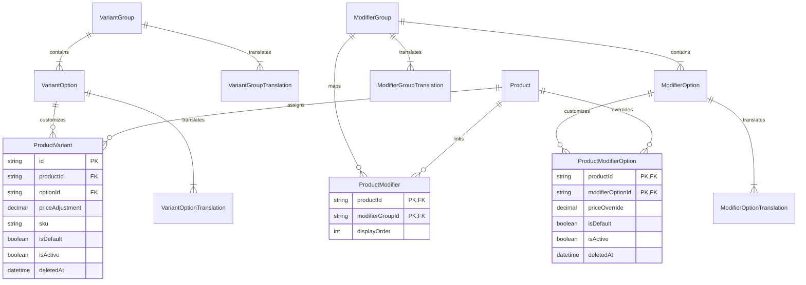

# Teras Lmbur OS — Sprint 1 — Slice 5
# Design Freeze & Architectural Specification
# Variant & Modifier Engine

---

## 1. Executive Summary

This document establishes the frozen technical design and API contracts for the **Variant & Modifier Engine** of the Teras Lmbur OS platform. 

This engine is a core restaurant configuration module. It allows the menu to scale dynamically from simple products to highly customizable, multi-option items (e.g., steaks with doneness variants, pizzas with customizable toppings, beverage sizes with custom sugar/ice levels).

### Core Goals
- **Single Source of Truth**: Define templates globally (e.g. a single "Size" variant group or "Beverage Add-ons" modifier group) that can be assigned to thousands of products without duplicating metadata.
- **Product-Specific Customization**: Allow specific products to override option availability, custom price adjustments, and default selections.
- **Cross-Channel Compatibility**: Deliver identical structural customizing layouts across all interfaces (POS, Kitchen Display, QR Web Ordering, WhatsApp, and Partner APIs).

---

## 2. Entity Relationship Diagram (ERD)

The following Mermaid diagram represents the normalized schema and the custom junction-override tables designed to scale horizontally on PostgreSQL.



---

## 3. Database Schema Specifications

To fulfill the requirements without schema regression, the following Prisma models will be verified and migrated.

### 3.1 Variant Models

```prisma
// Reusable Variant Templates
model VariantGroup {
  id           String                    @id @default(cuid())
  options      VariantOption[]
  translations VariantGroupTranslation[]
  createdAt    DateTime                  @default(now())
  updatedAt    DateTime                  @updatedAt
  deletedAt    DateTime?

  @@index([deletedAt])
}

model VariantGroupTranslation {
  id             String       @id @default(cuid())
  variantGroupId String
  variantGroup   VariantGroup @relation(fields: [variantGroupId], references: [id], onDelete: Cascade)
  locale         String
  name           String

  @@unique([variantGroupId, locale])
}

model VariantOption {
  id              String                     @id @default(cuid())
  groupId         String
  group           VariantGroup               @relation(fields: [groupId], references: [id], onDelete: Cascade)
  displayOrder    Int                        @default(0)
  productVariants ProductVariant[]
  translations    VariantOptionTranslation[]
  deletedAt       DateTime?

  @@index([groupId, displayOrder])
  @@index([deletedAt])
}

model VariantOptionTranslation {
  id              String        @id @default(cuid())
  variantOptionId String
  variantOption   VariantOption @relation(fields: [variantOptionId], references: [id], onDelete: Cascade)
  locale          String
  name            String

  @@unique([variantOptionId, locale])
}

// Product-specific Variant Mapping
model ProductVariant {
  id              String        @id @default(cuid())
  productId       String
  product         Product       @relation(fields: [productId], references: [id], onDelete: Cascade)
  optionId        String
  option          VariantOption @relation(fields: [optionId], references: [id], onDelete: Cascade)
  priceAdjustment Decimal       @db.Decimal(12,2) @default(0.00)
  sku             String?       @unique
  isDefault       Boolean       @default(false)
  isActive        Boolean       @default(true)
  createdAt       DateTime      @default(now())
  updatedAt       DateTime      @updatedAt
  deletedAt       DateTime?

  @@unique([productId, optionId])
  @@index([productId, isActive])
  @@index([deletedAt])
}
```

### 3.2 Modifier Models

```prisma
// Reusable Modifier Templates
model ModifierGroup {
  id           String                     @id @default(cuid())
  isRequired   Boolean                    @default(false)
  minSelect    Int                        @default(0)
  maxSelect    Int                        @default(1)
  options      ModifierOption[]
  products     ProductModifier[]
  translations ModifierGroupTranslation[]
  createdAt    DateTime                   @default(now())
  updatedAt    DateTime                   @updatedAt
  deletedAt    DateTime?

  @@index([deletedAt])
}

model ModifierGroupTranslation {
  id              String        @id @default(cuid())
  modifierGroupId String
  modifierGroup   ModifierGroup @relation(fields: [modifierGroupId], references: [id], onDelete: Cascade)
  locale          String
  name            String

  @@unique([modifierGroupId, locale])
}

model ModifierOption {
  id              String                      @id @default(cuid())
  groupId         String
  group           ModifierGroup               @relation(fields: [groupId], references: [id], onDelete: Cascade)
  priceAdjustment Decimal                     @db.Decimal(12,2) @default(0.00)
  displayOrder    Int                         @default(0)
  isActive        Boolean                     @default(true)
  translations    ModifierOptionTranslation[]
  productOverrides ProductModifierOption[]
  deletedAt       DateTime?

  @@index([groupId, displayOrder])
  @@index([deletedAt])
}

model ModifierOptionTranslation {
  id               String         @id @default(cuid())
  modifierOptionId String
  modifierOption   ModifierOption @relation(fields: [modifierOptionId], references: [id], onDelete: Cascade)
  locale           String
  name             String

  @@unique([modifierOptionId, locale])
}

// Product-to-Modifier-Group Junction
model ProductModifier {
  productId       String
  modifierGroupId String
  displayOrder    Int           @default(0)
  product         Product       @relation(fields: [productId], references: [id], onDelete: Cascade)
  group           ModifierGroup @relation(fields: [modifierGroupId], references: [id], onDelete: Cascade)

  @@id([productId, modifierGroupId])
  @@index([productId])
}

// Product-specific Modifier Option Customizations
model ProductModifierOption {
  productId         String
  modifierOptionId  String
  priceOverride     Decimal?      @db.Decimal(12,2) // Product-specific price override
  isDefault         Boolean       @default(false)
  isActive          Boolean       @default(true)
  createdAt         DateTime      @default(now())
  updatedAt         DateTime      @updatedAt
  deletedAt         DateTime?

  product           Product        @relation(fields: [productId], references: [id], onDelete: Cascade)
  option            ModifierOption @relation(fields: [modifierOptionId], references: [id], onDelete: Cascade)

  @@id([productId, modifierOptionId])
  @@index([productId, isActive])
  @@index([deletedAt])
}
```

---

## 4. Detailed Business Rules

### 4.1 Variants
- **Single Selection Constraint**: In any variant group assigned to a product (e.g. Coffee Size), the customer MUST choose exactly one option.
- **Enforcement**: If a variant group is assigned to a product, it is implicitly required. There must always be at least one `ProductVariant` active, and exactly one designated as `isDefault: true`.
- **Pricing**: The total item base price is calculated as `Product.sellingPrice + ProductVariant.priceAdjustment`.
- **SKU Mapping**: Every product variant assignment may have an individual SKU (e.g. `COFFEE-L`) to facilitate inventory tracking. If left blank, the system falls back to `Product.sku + "-" + VariantOption.code`.

### 4.2 Modifiers
- **Multiple Selection Constraint**: A modifier group (e.g., "Toppings") can allow selecting multiple options, controlled by `minSelect` and `maxSelect`.
- **Validation**:
  - `minSelect == 0` implies options are optional.
  - `minSelect > 0` requires the customer to select at least that number of modifier choices.
  - `maxSelect` defines the maximum allowed choices.
- **Quantities**: If supported in the POS configuration, a modifier group can allow selecting multiples of the same option (e.g., "Double Extra Cheese").
- **Overrides**: Product-specific default selections and pricing overrides are loaded via `ProductModifierOption` during cart initialization.

---

## 5. API Contracts Specification

All REST APIs return the standard JSON envelope structure:
```json
{
  "success": true,
  "data": {}
}
```

### 5.1 Endpoints List

| HTTP Verb | Path | Description | Required Permission |
|-----------|------|-------------|---------------------|
| **POST** | `/api/v1/variants/groups` | Create variant template group | `variants.create` |
| **GET** | `/api/v1/variants/groups` | Paginated filterable search of templates | `variants.read` |
| **PUT** | `/api/v1/variants/groups/:id` | Update variant group & translations | `variants.update` |
| **DELETE**| `/api/v1/variants/groups/:id` | Soft delete group template | `variants.delete` |
| **POST** | `/api/v1/modifiers/groups` | Create modifier template group | `modifiers.create` |
| **GET** | `/api/v1/modifiers/groups` | Paginated search of modifiers | `modifiers.read` |
| **PUT** | `/api/v1/modifiers/groups/:id` | Update modifier group details | `modifiers.update` |
| **DELETE**| `/api/v1/modifiers/groups/:id` | Soft delete modifier template | `modifiers.delete` |
| **POST** | `/api/v1/products/:id/variants` | Assign / override variants for a product | `products.assign_variants` |
| **POST** | `/api/v1/products/:id/modifiers` | Assign / override modifiers for a product | `products.assign_modifiers` |

---

## 6. RBAC Permission Matrix

| Role | `variants.*` (CRUD) | `modifiers.*` (CRUD) | `products.assign_variants` | `products.assign_modifiers` |
|------|---------------------|----------------------|----------------------------|-----------------------------|
| **OWNER** | ✅ Full Access | ✅ Full Access | ✅ Full Access | ✅ Full Access |
| **MANAGER**| ✅ Full Access | ✅ Full Access | ✅ Full Access | ✅ Full Access |
| **CASHIER**| ❌ Read Only | ❌ Read Only | ❌ Denied | ❌ Denied |
| **KITCHEN**| ❌ Read Only | ❌ Read Only | ❌ Denied | ❌ Denied |

---

## 7. Audit & Event Architecture

### 7.1 Domain Events
All events extend `BaseDomainEvent` and are dispatched on the core event bus:

1. `VariantGroupCreatedEvent` / `VariantGroupUpdatedEvent` / `VariantGroupDeletedEvent`
2. `ModifierGroupCreatedEvent` / `ModifierGroupUpdatedEvent` / `ModifierGroupDeletedEvent`
3. `ProductVariantsAssignedEvent` (Fired when product assignments or prices are adjusted)
4. `ProductModifiersAssignedEvent`

### 7.2 Audit Log Strategy
Whenever a modifier group or product variant mapping is altered, an audit record must be written.

#### Example Audit Record Structure:
```json
{
  "action": "UPDATE_PRODUCT_MODIFIERS",
  "resource": "ProductModifier",
  "resourceId": "prod-cuid-123",
  "oldValue": {
    "assignedGroups": ["mod-group-beverages"]
  },
  "newValue": {
    "assignedGroups": ["mod-group-beverages", "mod-group-toppings"]
  },
  "reason": "Expanding customizable menu options for season promotion"
}
```

---

## 8. Cache Strategy (Redis)

To ensure rapid sub-10ms response times for QR Menu and POS checkout catalogs:
- **Cache Keys**:
  - `catalog:product:*:variants` (Resolved list of active variants with localized labels)
  - `catalog:product:*:modifiers` (Resolved list of active modifier groups and option overrides)
- **Invalidation Triggers**:
  - When `VariantGroup` or `VariantOption` updates $\rightarrow$ Invalidate related product cache keys.
  - When `ProductVariant` or `ProductModifierOption` is mutated $\rightarrow$ Invalidate that product's specific catalog keys immediately.

---

## 9. User Interface & Responsive Mockup Blueprint

The UI will be built as two main views under the Master Data sidebar settings:

### 9.1 Variant & Modifier Groups Panel
- **Master-Detail Layout**: Left column displays a scrollable card grid of templates with searching and active/inactive status toggles. Right column displays a sliding Radix Drawer to edit translation names and display order.
- **Drag-and-Drop Ordering**: Let restaurant managers drag options to define how they order on the customer-facing QR menu.

### 9.2 Product Association Sheet
- Opened as an overlay from the main Product page catalog list.
- **Price Preview**: Shows a list calculated in real time displaying:
  $$\text{Final Option Cost} = \text{Product Base Price} + \text{Price Adjustment}$$
- **Default Switch**: Radio buttons to designate which option is preselected for the customer.

---

## 10. Localization Schema

Translations are stored in dedicated sidecar tables (`VariantGroupTranslation`, `VariantOptionTranslation`, etc.) mapping to the `locale` parameter (`en`, `id`, `ar`).
The `TranslationService` resolves the localized attributes dynamically based on the current `Request-Language` header context.

---

## 11. Technical Risk Assessment

1. **Prisma Cascading Cascades**:
   - *Risk*: Standard cascading deletes on templates can accidentally wipe custom product-specific price adjustment rows.
   - *Mitigation*: Ensure `onDelete: Cascade` only applies to translations and standard templates, whereas mappings on specific `ProductVariant` and `ProductModifierOption` rows are soft-deleted via the `deletedAt` field timestamp.
2. **Cache Stampede on Peak Hours**:
   - *Risk*: Invalidating a global variant template invalidates cache for all assigned products simultaneously, causing a database query spike.
   - *Mitigation*: Implement probabilistic early expiration (cache warming) or load option detail lookups via dynamic background queues.

---

## 12. Future Extensions & Bundle Architecture

- **Combo Meal Deals**: The `ProductModifierOption` model is structurally compatible to map another `productId` as the option target, converting standard customizable text options into bundle selection options (e.g. "Choose your drink" $\rightarrow$ links to Soda Product).
- **Time-bound Modifiers**: The schema can easily support `activeFrom` / `activeTo` timestamp fields for dynamic seasonal custom offerings (e.g. Christmas toppings).

---

## 13. Implementation Checklist

- [ ] Execute database migration file applying indices on `deletedAt` and composite foreign key indices.
- [ ] Implement backend repositories (`VariantRepository`, `ModifierRepository`).
- [ ] Register NestJS routing controllers with RBAC guards.
- [ ] Design TanStack Query catalog caching layers.
- [ ] Connect drag-and-drop React ordering lists on the dashboard drawer.

---

## 14. Architecture Score

- **Normalisation Level**: 9.5/10 (Clear templates vs. option-level override tables prevent database bloating)
- **Query Complexity**: Low (Utilizes direct primary key indexing and composite FK matching)
- **Extensibility**: 10/10 (Pre-designed to support Combo Products and Bundle deals by utilizing normalized mapping tables)
- **Maintainability**: 9.8/10 (Full translations tables segregation avoids schema locks for future multi-lingual translations additions)
